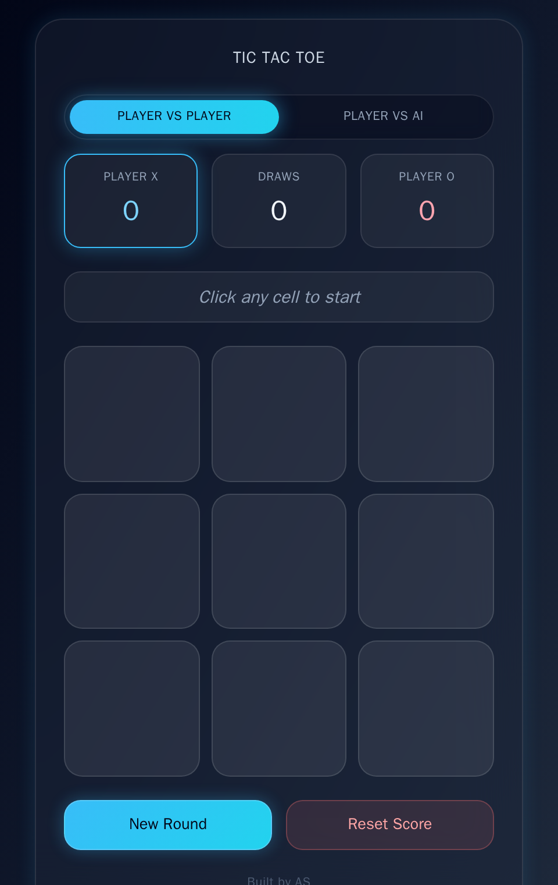
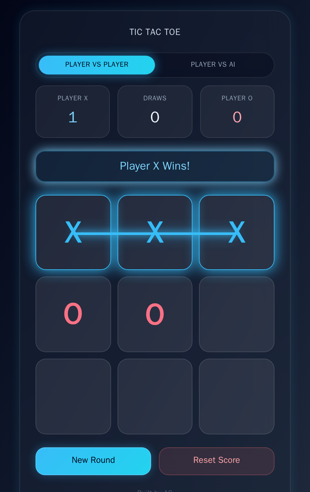
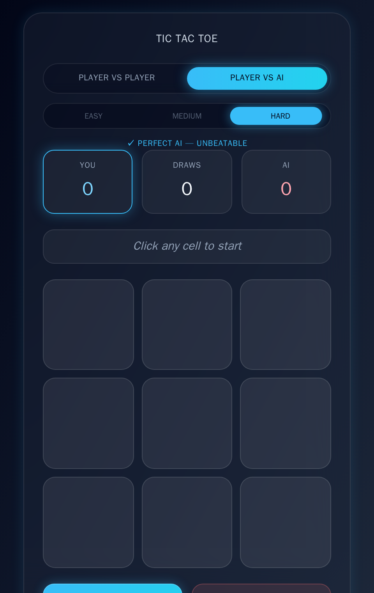

# ⭕ Tic Tac Toe

A classic two-player Tic Tac Toe game reimagined with a clean, modern dark glassmorphism interface, built with **HTML5**, **Tailwind CSS**, and **vanilla JavaScript** — no frameworks, no build step, no dependencies to install.

It keeps the simple, familiar rules of the game while adding a live scoreboard, a color-coded turn/result indicator, and smooth hover and win animations for a more polished feel.

---

## 📸 Screenshot / Preview

<table align="center">
  <tr>
    <td align="center">
       
      <b>Player vs Player — Ready to Play</b>
    </td>
    <td align="center">
       
      <b>Winning Line & Celebration Glow</b>
    </td>
    <td align="center">
       
      <b>Player vs AI — Hard (Unbeatable)</b>
    </td>
  </tr>
</table>

---

## ✨ Key Features

- 🎨 **Modern glassmorphism design** — frosted-glass card, soft borders, and a subtle ambient glow over a dark gradient background, styled entirely with Tailwind CSS via CDN.
- 🤖 **Player vs AI mode** — a sliding mode selector switches between two-player and solo play, with three difficulty levels:
  - **Easy** — random valid moves
  - **Medium** — takes obvious wins/blocks, with an occasional random move
  - **Hard** — an unbeatable Minimax + Alpha-Beta Pruning AI (shows a "Perfect AI" badge)
- 🏆 **Score tracking** — a live scoreboard tracks wins/draws (Player X / Player O in two-player mode, You / AI in AI mode), with the active player's card glowing on their turn.
- 🔁 **Reset / New Game controls** — **New Round** clears the board to keep playing with the same score; **Reset Score** starts completely fresh.
- 🚦 **Winning status indicator** — a color-coded status banner announces whose turn it is and highlights the winning row/column/diagonal with an animated line and pulsing glow when the game ends, or a draw otherwise.
- 🎬 **Smooth UI** — cells lift and glow on hover, pop in when marked, the AI's move gets a brief highlight, and the whole board is built from accessible `<button>` elements.
- 📱 **Responsive design** — the board and layout scale cleanly across desktop, tablet, and mobile screens.

---

## 🛠️ Tech Stack

| Layer      | Technology                        |
|------------|------------------------------------|
| Structure  | HTML5                              |
| Styling    | Tailwind CSS (via CDN)             |
| Behavior   | JavaScript (ES6+, vanilla)         |

---

## 🚀 How to Run

No installation, build tools, or dependencies are required.

1. Clone or download this repository.
2. Open `index.html` directly in any modern browser (Chrome, Firefox, Edge, Safari).

That's it — the game runs entirely client-side.

---

## 🔮 Future Enhancements

- 🌗 Light/dark theme switcher
- 📏 Adjustable board size (e.g. 4×4, 5×5)
- 🔊 Sound effects for moves and wins
- 📴 Offline support via PWA

---

## 🙌 Credits

Built by **AS**.
